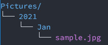
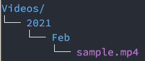
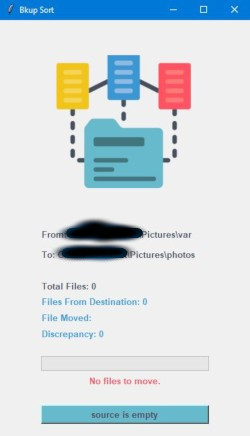

# BKUPSORT

bkupsort creates folders for files and move files within the created directories.

## Dependencies
* autopep8==1.5.6
* progress==1.5
* pycodestyle==2.7.0
* toml==0.10.2

## Configurations
Within the script, you will find these three variables. These are the paths, *source* and *destination*.  

**photo_path** = *G:\Pictures* 
**video_path** = *G:\Videos* 
**var_path** = *G:\var*

## How It Works
As soon as the program starts, it will call a function from **bkup.tarname_gen** *"tarname_gen()"*. This function simply rename the **bkup.tar** file to e.g. **bkup_20210510_182030{100}.tar**. This file is located in Desktop/PhoneBackup directory.

The program then checks the *var/* directories content, this is the value in the variable **var_path**. If the mentioned directory is not empty, collect the filename and the created date for each of the files in the *var/* directory. If the file is created on **01-01-2021**, bkupsort will create a **2021** folder and within that folder, it will then create a **Jan** folder then move the associated file within the created folder. This process continues until *var/* directory is empty.

## Structure
This is the outcome after running bkupsort. The root directory is specified in **photo_path** and **video_path**. 

## File Type
bkupsort will only work on these files.

##### **Photo Files:**
*  jpeg
*  jpg
*  png

##### **Video Files**:
*  mp4
*  3gp

## How To
### First Way
1. Double click on the bkupsort.bat-Shortcut icon located in your Desktop

### Second Way
1. Open up Command Prompt
2. Change directory into where bkupsort is located. This is in **_Desktop\bkupsort_** directory. In the command prompt type `cd Desktop\bkupsort` and hit enter.
3. Because bkupsort packages is managed by pipenv *(a package manager in python)*, before runing the program, you first need to activate the virtual environment. After doing the step 2, type `pipenv shell` and hit enter.
4. You can now run the program by typing `python bkupsort.py` and hit enter. 

5. Click the **Start** button and wait for the process to complete.